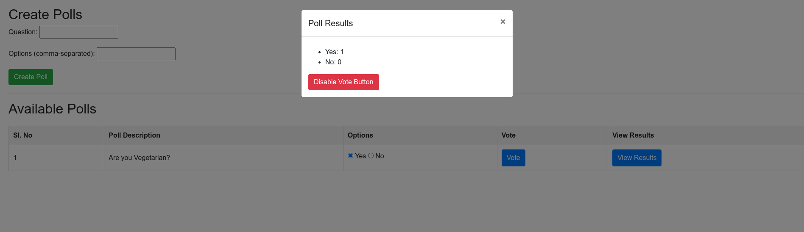

# PollingAPI
- This is simple RestApi to create, vote and view the results of polls. It is created using java+spring boot framework.
- Concepts used : `Spring-Boot`, `Hibernate/JPA-ORM`, `Rest API`, `MVC(in minor terms)`

## Execution steps:
### 1.Run JAR
- Make sure to install MySql server and enable it
- Create a database named `pollapp` and update the respective credentials in `src/main/resources/application.properties`
- Execute the below command to host the app
    ```
    java -jar ./target/PollingApp-0.0.1-SNAPSHOT jar              
    ```
### 2.Using docker-compose
- Make sure you have docker and docker-compose installed in your system.
- Create a network "my-network" using below commmand:
    ```
    sudo docker network create --gateway 192.168.1.1 --subnet 192.168.1.0/24 my-network
    ```
- Build the docker images, while located in root directory of project:
    ```
    docker-compose build
    ```
- Running the app and server:
    ```
    docker-compose up
    ```
### Frontend Access
- Enter the below address in any browser to interact with the API
    ```
    http://localhost:8080/
    ```

## Demo Screenshot

 
 
 
 
 

